# Telumera — C4 Container Diagram

> Status: Draft (M00.1)

Breaks the single "Telumera Platform" box from `docs/architecture/c4-context.md` into its containers
(independently buildable/deployable services, per
`docs/adr/0001-service-oriented-modular-platform.md`). Ownership rules for each container's data are
detailed in `docs/architecture/bounded-contexts-and-data-ownership.md`.

```mermaid
C4Container
    title Telumera — Container Diagram (Platform Foundation + first data modules)

    Person(owner, "Platform Owner / Developer")
    System_Ext(trackedSite, "Tracked Website", "Runs the Telumera browser SDK")
    System_Ext(entra, "Microsoft Entra ID")
    System_Ext(aiProvider, "Claude")

    System_Boundary(telumera, "Telumera Platform") {
        Container(dashboard, "Web Dashboard", "Vue 3 + TypeScript", "Module navigation and all product UI. Holds no business data of its own.")
        Container(gateway, "API Gateway / BFF", "ASP.NET Core", "Authenticated public read API; composes responses across services. Holds no module data.")

        Container(identity, "Identity & Workspace Service", "ASP.NET Core", "Users, workspaces, memberships, roles")
        Container(siteRegistry, "Site Registry Service", "ASP.NET Core", "Sites, domains, browser site tokens (public ingestion tokens), settings, enabled modules")
        Container(collector, "Event Collector", "ASP.NET Core", "Fast validation and acceptance of browser/agent events; no analytics queries")

        Container(analytics, "Analytics Service", "ASP.NET Core", "Page views, sessions, visitors, acquisition, custom events")
        Container(performance, "Performance Service", "ASP.NET Core", "Web Vitals and timing distributions")
        Container(errors, "Error Service", "ASP.NET Core", "Error occurrences and issue lifecycle")
        Container(deployments, "Deployment Service", "ASP.NET Core", "Releases and deployments")
        Container(conversions, "Conversion Service", "ASP.NET Core", "Goals, funnels, attribution")
        Container(seo, "SEO Scanner", "ASP.NET Core + worker", "Crawls and technical content checks")
        Container(sessionInsights, "Session Insights Service", "ASP.NET Core", "Click/scroll aggregates; optional replay")
        Container(aiInsights, "AI Insights Service", "ASP.NET Core", "Typed metric tools, generated insights, audit")
        Container(alerting, "Alerting Service", "ASP.NET Core", "Rules, alert state, evaluations")
        Container(notification, "Notification Service", "ASP.NET Core", "Email/Teams/webhook delivery")

        ContainerDb(pgIdentity, "Identity PostgreSQL", "PostgreSQL", "Owned solely by Identity & Workspace")
        ContainerDb(pgSite, "Site PostgreSQL", "PostgreSQL", "Owned solely by Site Registry")
        ContainerDb(chAnalytics, "Analytics ClickHouse schema", "ClickHouse", "Owned solely by Analytics Service")
        ContainerDb(objectStore, "Object Storage", "MinIO / Azure Blob", "Shared infrastructure; namespaced per owning context (e.g. telumera-errors, telumera-seo, telumera-sessions, telumera-exports) — see docs/adr/0005-context-level-data-isolation.md")

        Container(pubsub, "Dapr Pub/Sub", "Dapr building block", "RabbitMQ (self-hosted) or Azure Service Bus Topics (Azure); versioned CloudEvents, at-least-once delivery")
    }

    Rel(owner, dashboard, "Uses", "HTTPS")
    Rel(trackedSite, collector, "Sends batched events", "HTTPS")
    Rel(dashboard, gateway, "Calls", "HTTPS/JSON")
    Rel(gateway, identity, "Reads/validates", "HTTPS or Dapr invoke")
    Rel(gateway, siteRegistry, "Reads", "HTTPS or Dapr invoke")
    Rel(gateway, analytics, "Reads via query API", "HTTPS or Dapr invoke")
    Rel(gateway, performance, "Reads via query API", "HTTPS or Dapr invoke")
    Rel(gateway, errors, "Reads via query API", "HTTPS or Dapr invoke")

    Rel(collector, siteRegistry, "Validates site key / origin against a local cached projection; falls back to a live call only on cache miss / warm-up", "Dapr invoke")
    Rel(siteRegistry, pubsub, "Publishes site.created.v1 / site.settings.changed.v1 / site.disabled.v1 / site.key.rotated.v1 to keep collector projections current")
    Rel(collector, pubsub, "Publishes accepted events", "Dapr pub/sub")

    Rel(analytics, pubsub, "Publishes analytics.processed.v1")
    Rel(errors, pubsub, "Publishes error.issue.changed.v1")
    Rel(deployments, pubsub, "Publishes deployment.completed.v1")
    Rel(seo, pubsub, "Publishes seo.scan.completed.v1")
    Rel(alerting, pubsub, "Publishes notification.requested.v1")

    Rel(pubsub, analytics, "analytics.page-view.received.v1 / analytics.custom-event.received.v1 / deployment.completed.v1 (release correlation)")
    Rel(pubsub, performance, "performance.sample.received.v1 / deployment.completed.v1 (release correlation)")
    Rel(pubsub, errors, "error.occurrence.received.v1 / deployment.completed.v1 (release correlation)")
    Rel(pubsub, conversions, "analytics.processed.v1")
    Rel(pubsub, alerting, "error.issue.changed.v1 / seo.scan.completed.v1 / analytics.processed.v1")
    Rel(pubsub, aiInsights, "analytics.processed.v1 / error.issue.changed.v1 / seo.scan.completed.v1 / deployment.completed.v1")
    Rel(pubsub, notification, "notification.requested.v1 (from any module)")

    Rel(identity, pgIdentity, "Reads/writes")
    Rel(siteRegistry, pgSite, "Reads/writes")
    Rel(analytics, chAnalytics, "Reads/writes")
    Rel(errors, objectStore, "Stores source maps")
    Rel(sessionInsights, objectStore, "Stores replay chunks")

    Rel(identity, entra, "Delegates authentication", "OIDC")
    Rel(aiInsights, aiProvider, "Requests inference, offering approved typed tool definitions; executes any tool call Claude requests against other services' public APIs and returns the result", "HTTPS API")
```

## Notes

- **No shared business database**: each `ContainerDb` above is drawn as owned by exactly one service.
  PostgreSQL/ClickHouse may host multiple services' schemas on one physical server for cost reasons, but
  only the owning service ever connects to its own schema — see
  `docs/adr/0003-postgresql-plus-clickhouse.md` and `docs/architecture/bounded-contexts-and-data-ownership.md`.
- **Dapr Pub/Sub is drawn as one container** for readability, but it's a portability abstraction, not a
  single deployed thing — self-hosted it's backed by RabbitMQ, on Azure by Service Bus Topics (Topics, not
  Queues, since several events fan out to multiple independent subscribers). See
  `docs/adr/0002-dapr-pubsub-abstraction.md`.
- **Scope: target architecture, not a "build this now" list.** Only Platform Foundation (M00) plus
  Analytics/Performance/Errors/Deployment (M01–M04) are in near-term scope. Every other container drawn
  here — Conversion Service (M05), SEO Scanner (M06), Session Insights (M07), AI Insights (M08), Alerting
  (M09), Notification (M09) — is modeled now only because its event subscriptions are already specified in
  `planning/Telumera_Modular_Project_Plan.md` §8.3, not because it's expected to exist during M00/M01. If
  this diagram is read as "what must be running for M00/M01 to be done," that's a misread — treat the
  module roadmap table in `CLAUDE.md` / the project plan as the authority on what's actually built at any
  given point, not container presence here.
- The gateway/BFF talking to services "via HTTPS or Dapr invoke" reflects that the plan doesn't mandate
  one mechanism — synchronous reads may go through direct HTTP APIs or Dapr service invocation depending
  on what's simplest per-service; this should be made concrete in each service's own docs as it's built.
- **Collector → Site Registry is not a live call on every event.** The Collector is expected to be the
  platform's hottest path, so it validates against a local read-model projection (site ID, active
  token(s), allowed origins, module enablement, rate-limit config) kept warm by subscribing to Site
  Registry's config-change events, not by calling Site Registry synchronously per request. The direct
  `Dapr invoke` path exists for cache misses, warm-up, and administration — not the steady-state hot path.
- **Producer/consumer pairs use an outbox where the producer also has transactional state to protect.**
  Deployment, Errors, Alerting, and other services that both write PostgreSQL state and publish an
  integration event use the transactional outbox pattern (single DB transaction writes the state change
  and an outbox row; a separate publisher drains the outbox) so a crash between the DB write and the
  publish can't silently drop the event — see `docs/adr/0004-transactional-outbox-and-idempotent-consumers.md`.
  High-volume append-only analytics ingestion (Collector → Pub/Sub) is not required to go through this
  pattern.
