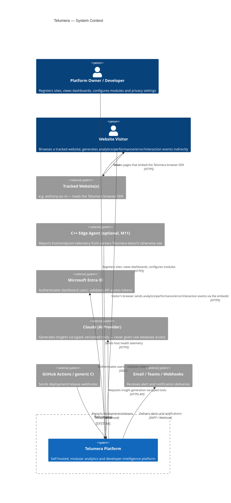

# Telumera — C4 Context Diagram

> Status: Draft (M00.1)

Shows Telumera as a single system boundary and the people/external systems it interacts with. See
`docs/architecture/c4-container.md` for the breakdown inside the boundary.

## Notes

- **The visitor's browser is the actual network peer, not the tracked website's server.** The SDK
  executes client-side; once loaded, it sends telemetry straight from the visitor's browser to the
  Telumera Event Collector over HTTPS. The tracked website's own server is not in that request path at
  all for standard browser tracking. This matters for the privacy threat model
  (`docs/privacy/privacy-threat-model.md`): Telumera's collector receives a real inbound request
  (including the visitor's IP at the network layer) from the visitor's device, not a
  server-to-server relay — the SDK still only sends what it's configured to send, under the site
  owner's consent/privacy configuration, but the *connection* is visitor → Telumera directly.
- The AI provider relationship is intentionally one-directional and tool-scoped — see
  `planning/Telumera_Modular_Project_Plan.md` §7 (M08) and the AI Insights row in
  `docs/architecture/bounded-contexts-and-data-ownership.md`.
- The C++ edge agent and CI provider are drawn as external systems even though the edge agent is part of
  the long-term Telumera product (M11), because from the platform's context boundary they connect the
  same way any external event source would — over HTTPS, authenticated per-site.
- **Hosting environment (Docker Compose / Azure Container Apps) is deliberately not modeled here.** A C4
  System Context diagram shows actors and external systems the software exchanges data with, not what
  it's deployed on — that belongs in a deployment diagram. The self-hosted/Azure targets are already
  documented in `docs/adr/0002-dapr-pubsub-abstraction.md`; dedicated `c4-deployment-*.md` diagrams can
  be added later if the deployment topology itself needs diagramming (e.g. once M00.3's Docker Compose
  stack and the Azure Bicep target exist).
