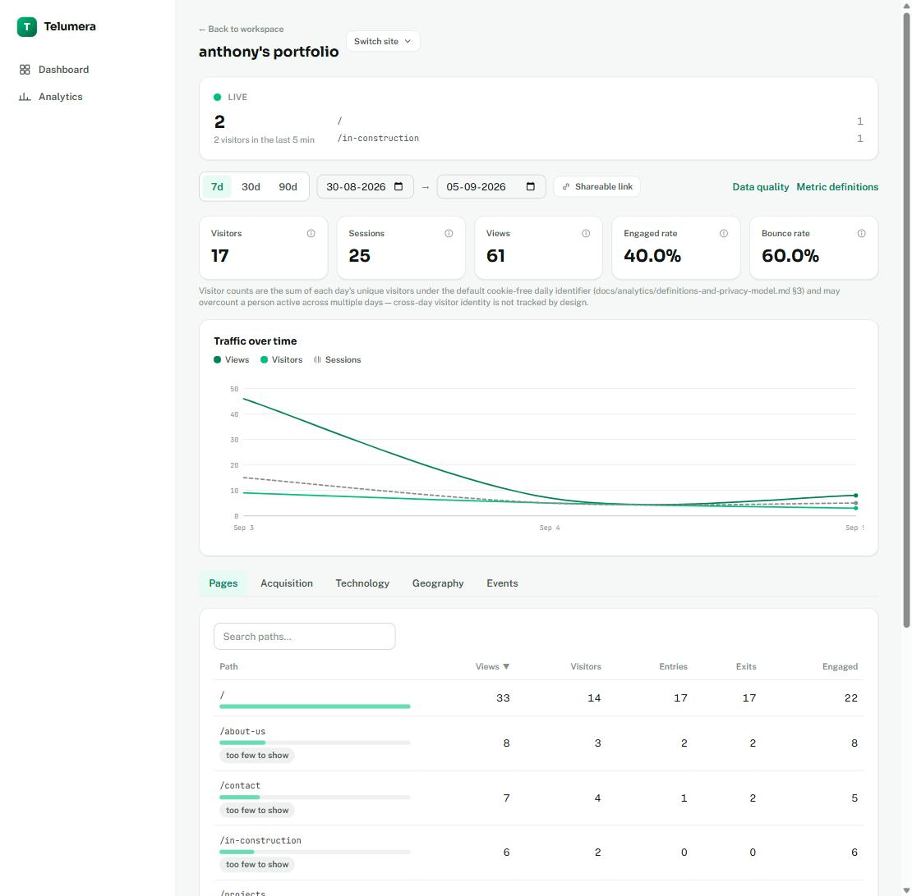
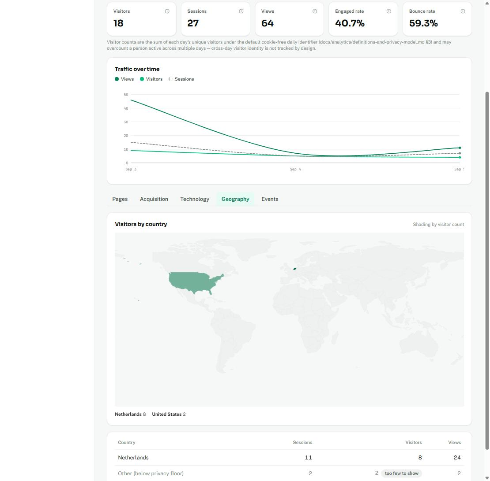
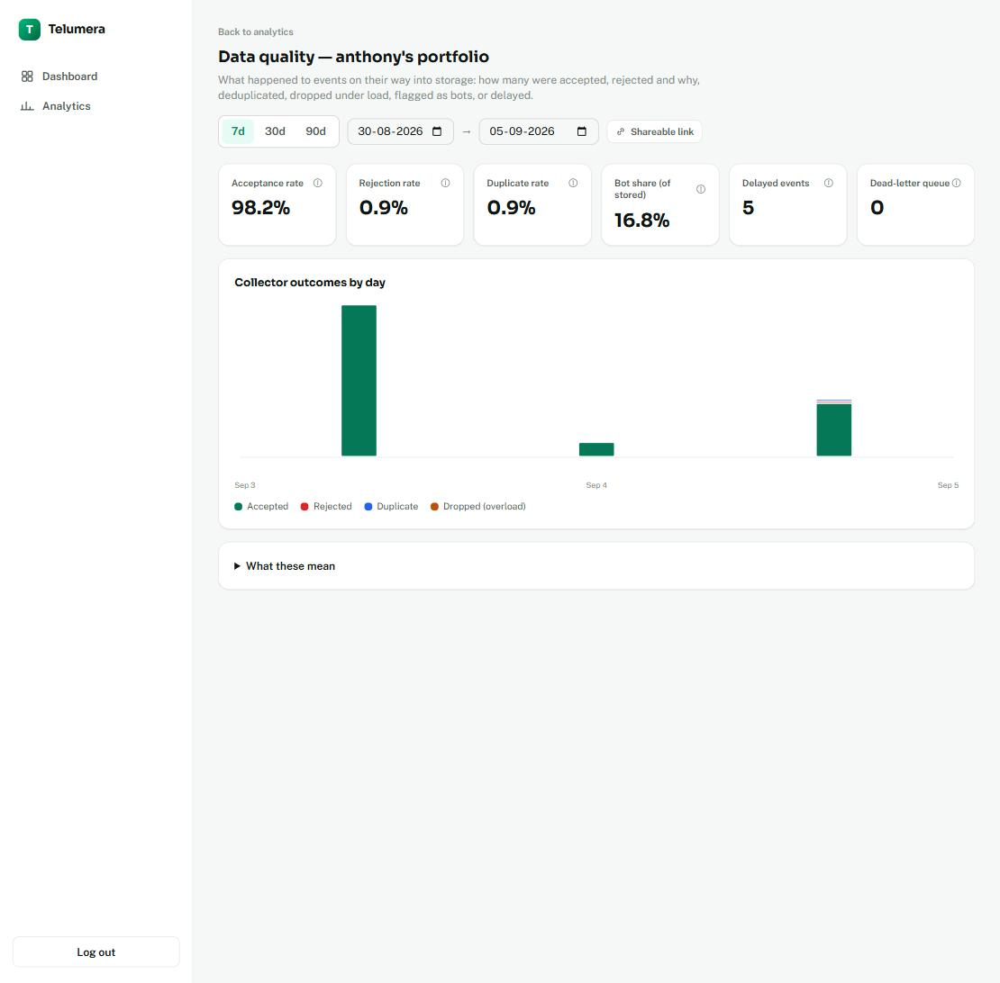

# Case Study: Building Product Analytics — Auditable, Privacy-First, Self-Hosted

> A case study covering Telumera's first shipped module, Product Analytics (backlog milestones M01.1
> through M01.8). Written after the module went live end-to-end against a real domain
> (`anthony-air.nl` → `telumera.nl`) on 2026-09-03.

## The problem

Every mainstream web analytics tool forces a choice: privacy-invasive defaults (cross-site tracking,
fingerprinting, ad-network data sharing), or a bundle of narrow single-purpose tools, or metrics you have
to take on faith because there's no way to see what was filtered out and why. Telumera's Product Analytics
module was built to test whether a self-hosted, modular alternative could give a real answer to all three
at once — for one real site first, `anthony-air.nl`, with the intent to generalize later.

The module's actual thesis isn't "more accurate analytics." It's the **Accuracy Principle**
(`docs/architecture/vision-and-scope.md` §5): *every number must be traceable back to what was actually
collected and what was filtered out and why* — not false precision. Concretely, that means every metric
this module reports ships with its documented definition, its raw-vs-processed event counts, its
duplicate/bot classification (marked, never silently dropped), its sampling state, and the privacy
configuration behind it. That constraint shaped almost every non-obvious decision below — it isn't a
compliance footnote, it's the design brief.

## Architecture, and the decisions that weren't obvious in advance

The module is a genuinely different shape of service depending on where you look in the pipeline, and
that shape was chosen deliberately at each stage rather than defaulting to one pattern everywhere:

**Event Collector — the one public, unauthenticated surface.** `services/event-collector` owns no
persistent data at all (`docs/architecture/bounded-contexts-and-data-ownership.md`), by design: it's the
one endpoint on the entire platform that has to accept traffic from an anonymous browser
(`docs/adr/0006-public-browser-ingestion-tokens.md`), so it's kept deliberately thin — validate, buffer,
publish, forget. Accepted events land in an in-memory bounded `Channel` drained by a `BackgroundService`
rather than a synchronous per-request Dapr publish, decoupling ingestion latency from publish latency at
the accepted cost (per ADR 0004, which explicitly exempts high-volume append-only ingestion from the
transactional-outbox pattern the rest of the platform uses) of a possible dropped event on a crash between
accept and publish. That trade-off is disclosed, not hidden.

**Analytics Service — where the real state lives, and why it isn't a streaming materialized view.** No
ClickHouse materialized-view or streaming-aggregate pattern existed anywhere in this codebase before this
module, and none was used here either: a 30-minute inactivity gap defines a session boundary
(`docs/analytics/definitions-and-privacy-model.md` §2), and an insert-triggered view structurally can't
know whether a later event still belongs to an already-closed session. Instead, sessions and the five
`daily_*_rollup` tables are periodically *recomputed* from a watermark (`aggregation_checkpoints`, a small
Postgres control table) that trails "now" by a safety buffer — late-event handling isn't a separate
mechanism bolted on afterward, it's a direct consequence of this one design: a late event for a
session closed days ago just makes that `session_id` dirty on the next tick, regardless of its age.

**The idempotency/ClickHouse-write ordering is a disclosed trade-off, not an oversight.** The Postgres
idempotency marker (`packages/idempotency`) commits *before* the ClickHouse write, not after and not in
one transaction — the two stores can't share one. That accepts rare event loss on a crash between the two
writes, in exchange for guaranteeing retries never double-count a metric. Given the module's actual goal —
preventing retry duplicates from inflating numbers — that was judged the correct side to err on, and
`tools/reconciliation-report` exists specifically to make any resulting gap visible rather than silent.

**Device/browser/OS classification is hand-rolled substring heuristics, not a fingerprinting library.**
The privacy threat model calls for "bounded categories... not full high-entropy fingerprint strings" — a
proper UA-parsing library would work against that requirement, not toward it, so `UserAgentClassifier.cs`
deliberately stays coarse.

**GeoIP is a local MMDB lookup, never a third-party API call.** `MmdbGeoLookup` reads a local
MaxMind-format country database in-process, keyed on an *already-truncated* IP, and stores only the ISO
country code — no IP column exists anywhere in the Analytics ClickHouse schema at all
(`docs/analytics/definitions-and-privacy-model.md` §7), which is a stronger guarantee than "we don't store
it by policy": there's no column for a future change to accidentally start populating.

**Live visitor projection is explicitly the weakest metric in the system, and it says so out loud.** The
5-minute Redis-backed live panel is never persisted, never reconciled, and never feeds a session, a
rollup, or the reconciliation report — it's "roughly who is here now," documented (§9) as structurally
different from every other number the dashboard shows, precisely so nobody mistakes it for one.

## Privacy by construction, not by policy

The default visitor identifier is computed server-side per event —
`hash(siteId + dailySalt + truncatedIp + userAgent)` — with the salt rotating every 24 hours. That's a
real, disclosed limitation: cross-day visitor retention is structurally unavailable in default mode, not
merely disabled. A site owner who needs it can opt into a persistent, consent-gated identifier — but that's
an explicit configuration choice, never a silent default. Query-string capture is allowlist-only
(`utm_*` by default), with a denylist safety net for anything that looks like a token or credential
regardless of allowlist status. Raw events carry a 90-day TTL enforced at the ClickHouse schema level;
aggregates carry a minimum-visitor-count floor (5 distinct visitors) below which a rollup row is flagged
`is_below_privacy_floor` — written and queryable, never silently hidden, the same "marked, not deleted"
convention applied to bot traffic.

## What broke — and how it was caught

The module's own philosophy — "auditable, not just claimed to work" — was applied to itself throughout
development: nearly every milestone was verified against a real running stack, not just compiled, and
that discipline is what actually surfaced the bugs below. None of these would have been caught by
`dotnet build` or a type-checker.

- **A ClickHouse "aggregate function found inside another aggregate function" error** — from reusing an
  outer `SELECT` alias inside a second expression in the same list — was only found by running the
  aggregation queries directly against a live ClickHouse instance before writing them into C#, a practice
  applied to every rollup query in the module from M01.5 onward.
- **A TTL cast bug**: applying a TTL to a `DateTime64` column in ClickHouse 24.8 fails outright without an
  explicit `toDateTime()` cast — invisible until tested against the real engine version in use.
- **A pre-existing, never-actually-passing integration test.** `CountClickHouseRowsAsync` called
  `JsonNode.GetValue<int>()` on a ClickHouse `count()` result, which ClickHouse's output format quotes as
  a JSON *string* (it's `UInt64`) — an `InvalidOperationException`, not a silent wrong answer. Running the
  *entire* integration suite together for the first time (M01.6), rather than milestone-by-milestone,
  is what surfaced it.
- **Bounce rate's zero-prior-period fallback was 100%, not 0%.** A fresh site's first-ever week showed
  "Bounce rate ↓ 0.0% vs prior period" — checking a single metric's own previous value against zero never
  caught "no prior data" for bounce rate specifically, because `1 - engagedRate` at 0% engaged is 100%
  bounce. Found only by driving the actual dashboard in a real browser against real data, fixed by gating
  every card's delta on `previous.sessions > 0` instead of a per-metric zero check.
- **A native `<dialog>`'s user-agent stylesheet silently overrides author CSS.** The glossary drawer
  rendered pinned to the left edge despite `right-0` in its own classes, because the dialog's top-layer
  UA stylesheet sets `inset: 0` (including `left: 0`), which `right-0` alone doesn't clear.
- **Dapr sidecars orphaned by a partial container recreate.** Recreating an app container alone (without
  its paired `network_mode: service:x` Dapr sidecar) leaves the sidecar bound to a dead network namespace
  — `localhost:3500` then refuses inside the new container and every Dapr call 500s. First hit in M01.3,
  *recognized instantly* by M01.4 rather than re-debugged from scratch, and finally closed permanently by
  having `deploy-nas.yml` force-recreate all five `*-dapr` sidecars after every deploy — this exact bug is
  what caused the whole dashboard to show "Couldn't load" and the live panel to go offline on the very
  first NAS deploy.
- **No CORS handling at all in the Event Collector**, found only after the very first real browser
  traffic from `anthony-air.nl` — every prior test of the collector had been server-to-server, so a
  cross-origin preflight simply had nowhere to go. Fixed with a *dynamic* per-request CORS policy keyed
  off each site's own registered `AllowedOrigins` (deliberately not the fixed origin list the gateway and
  analytics service use, since the collector is multi-tenant). The fix that shipped it initially crashed
  at startup (`AddCors` was never registered) — a DI failure `dotnet build` cannot catch, only a real
  deploy could.
- **GeoIP silently never installed**, despite an earlier note claiming it was — traced to a mis-pasted
  MaxMind license key in `.env.nas`, invisible until the Geography tab was checked against real traffic
  and `analytics`'s own startup log ("no MMDB database") was actually read.
- **Acquisition breakdown was UTM-only**, so real non-campaign traffic (LinkedIn, Google, direct) showed a
  channel with an empty source column — not a bug in the strict sense, but a gap only visible once real
  referrer traffic existed to expose it. Fixed by adding a `referrer_host` dimension derived from
  `domainWithoutWWW(referrer)`.

The common thread: type-checking, linting, and unit tests caught real problems, but the bugs that actually
would have reached a visitor — the CORS gap, the GeoIP misconfiguration, the bounce-rate fallback, the
sidecar orphaning — were only found by running the real pipeline against real traffic and reading its
actual output, not by inspecting the code that was supposed to produce it.

## Current status

As of 2026-09-03, the module is live end-to-end: `telumera.nl` (dashboard, gateway, analytics/live hub,
and event collector, each on its own subdomain behind a Cloudflare Tunnel and NPM) serves a real
workspace and site, `anthony-air.nl` is instrumented with the tracking SDK, and real page-view traffic
flows from the portfolio through the collector into the dashboard — overview, pages, the traffic chart,
the live-visitor panel, geography, and the acquisition source breakdown all reflect real visits. Deploys
are fully automated: a push to `main` builds container images and rolls them out to the NAS through a
dedicated self-hosted runner, with health checks gating a successful rollout.

Two verification steps that remained open are now closed out, both run for real against the live NAS
(2026-09-05):

- **Synthetic acceptance traffic.** Six scripted journeys (`tools/synthetic-traffic`) hit the live
  `collect.telumera.nl` — an engaged session, a bounce, a bot user agent, a duplicate event id, a
  malformed event (26 properties over the validator's 25-property cap), and an unknown site token —
  and every one returned exactly the expected collector response. `tools/reconciliation-report`
  against the same date showed **Accepted = Processed = Stored = 8**, a perfect reconciliation with
  no events lost between the collector and ClickHouse. The run also produced one instructive
  false-positive: all 8 events, not just the intentional "bot" journey, came back flagged
  `is_bot = 1`. The cause was in the test tool, not the pipeline — `BotDetector.IsBot` treats a
  missing User-Agent header as a bot signal (a deliberate, documented heuristic), and
  `synthetic-traffic` only sets a UA on its one deliberate bot journey, so every other journey looked
  identically bot-like to the classifier. Real browser traffic always carries a genuine UA, which is
  why this never surfaced during the M01.3–M01.6 live verification passes. With the pipeline
  confirmed clean, `anthony-air.nl`'s tracking snippet was switched from `environment: 'staging'` to
  `'production'`.
- **Backup and restore.** `backup.sh` (a `pg_dump` per context database, every ClickHouse table
  exported as gzipped `FORMAT Native`, RabbitMQ definitions) and `restore-test.sh` (throwaway
  Postgres/ClickHouse containers, checked against the backup's own row-count manifest) both ran
  clean against the live NAS — every table and row count matched exactly. Running this for real, not
  just reading the scripts, surfaced two gaps neither had a test for: both scripts only knew how to
  find `.env`/`.env.example`, so on the NAS (which has neither, only `.env.nas`) `backup.sh` would
  have silently authenticated with the wrong password against the real running containers; and the
  default backup destination sits inside the same directory `deploy-nas.yml`'s `rsync --delete`
  mirrors on every deploy, so a backup written there would be deleted by the very next push to
  `main`. Both fixed; `backup.sh` now runs nightly via cron to a destination outside the deploy tree.

## What this demonstrates

Beyond the analytics numbers themselves, this module is the first place several platform-wide patterns
were exercised for real: the transactional-outbox/idempotent-consumer pair (ADR 0004) under real retry
conditions, a genuine Dapr pub/sub subscriber reacting to another service's events with no restart
required, a live WebSocket surface that bypasses the Dapr-based gateway entirely because a sidecar-to-
sidecar forwarder can't carry a WebSocket upgrade, and a fully automated build-image-deploy pipeline
against a real self-hosted NAS with no manual step beyond a `git push`. The bugs list above is the part
of this case study most worth taking seriously: every one of them was caught because the module was
checked against something real — a live database, a live browser, live traffic — not because the code
looked correct on inspection.
